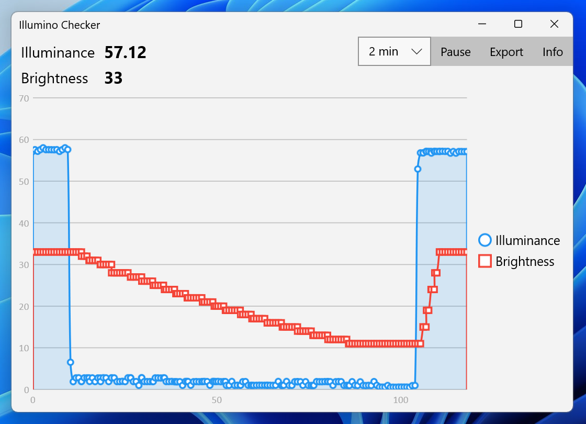
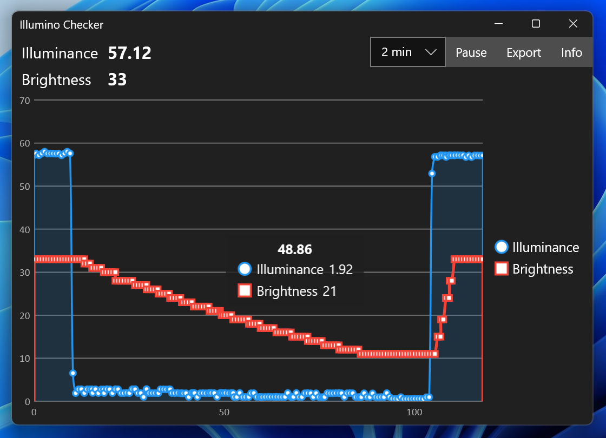

# Illumino Checker

Visualize ambient light sensor output (lux) and corresponding screen brightness adjusted by adaptive brightness.

 

When ambient light plummeted, the brightness gradually descended. In contrast, when ambient light returned, the brightness jumped up. (This is recorded on Surface Pro 8 and it depends on each model.)

https://user-images.githubusercontent.com/7205690/232183280-922f36fc-d0b2-4f3d-aef2-d54fe8e53f3b.mp4

 

If you are not familier with adaptive brightness, take a look the overview by Microsoft.

- [Adaptive brightness](https://learn.microsoft.com/en-us/windows-hardware/design/device-experiences/sensors-adaptive-brightness)

It is good to know how it actually works under the hood.

In addition, this app records the sequence of illuminance and brightness to internal log which can be exported in CSV format. A log will be deleted after one week has passed to avoid taking up storage space.

## Requirements

 * Windows 10 or newer
 * Ambient Light Sensor (ALS)

## Download

## Remarks

This app will go suspended 25 seconds after being minimized. This is common for all UWP apps.

This suspension can be avoided using `extendedBackgroundTaskTime` capability. But it will prevent this app from being distributed by Microsoft Store.

- [Run background tasks indefinitely](https://learn.microsoft.com/en-us/windows/uwp/launch-resume/run-in-the-background-indefinetly#run-background-tasks-indefinitely)

## License

 - MIT License

## Libraries

 - [LiveCharts](https://v0.lvcharts.com/)
 - [Community.Toolkit.Mvvm](https://github.com/CommunityToolkit/dotnet)

## Developer

 - emoacht (emotom[atmark]pobox.com)
